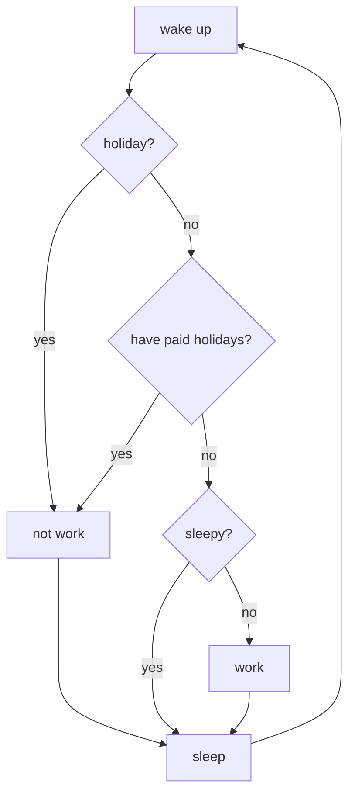

# Flowchart

```mermaid
flowchart TB
A[wake up] --> B{holiday?}
B -->|yes| C[not work]
B -->|no| D{have paid holidays?}
D -->|yes| C
D -->|no| E{sleepy?}
E -->|yes| F[sleep]
E -->|no| G[work]
C --> F
G --> F
F --> A
```